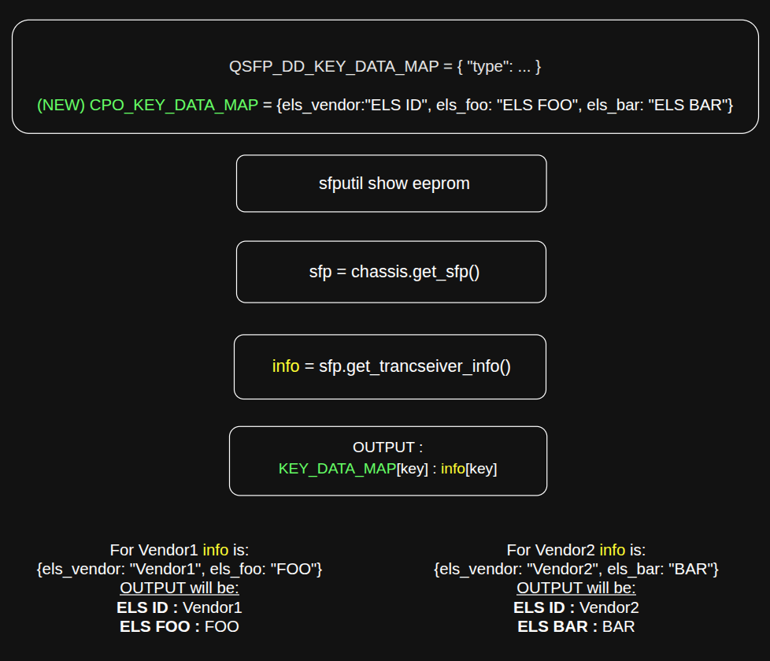

# Sfputil and Transceiver CLIs Alignment for CPO

## Table of Contents

1. [Revision](#1-revision)
2. [Definitions/Abbreviations](#2-definitionsabbreviations)
3. [Scope](#3-scope)
4. [Overview](#4-overview)
5. [CLI flows and per-command behavior](#5-cli-flows-and-per-command-behavior)
6. [Changes (new code)](#6-changes-new-code)

---

## 1. Revision

| Rev | Date | Author | Change Description                                                                          |
| --- | ---- | ------ | ------------------------------------------------------------------------------------------- |
| 0.1 |      |        | Initial version: CPO/ELS display alignment for `sfputil` and `show interfaces transceiver`. |

---

## 2. Definitions/Abbreviations

| Term     | Definition                                                                                                     |
| -------- | -------------------------------------------------------------------------------------------------------------- |
| CPO      | Co-Packaged Optics — integrated optics; transceiver **type** may be reported as a string `CPO`.                |
| ELS      | External Laser Source — related fields prefixed `els_*` in info/DOM/status dicts.                              |
| CMIS     | Common Management Interface Specification.                                                                     |
| DOM      | Digital Optical Monitoring — sensors and thresholds.                                                           |
| STATE_DB | Redis State DB; `xcvrd` publishes transceiver tables consumed by `sfpshow`.                                    |

---

## 3. Scope

This HLD covers **sonic-utilities** changes to align CLIs for the CPO (Banks/ELS) concept.

**Relevant (existing) CLIs** — requirement per command:

| #   | Command                                           | Requirement |
| --- | ------------------------------------------------- | ----------- |
| 1   | `sfputil read-eeprom -p -n -o -s`                 | No change: `platform_chassis.get_sfp(physical_port)` / `Sfp` is already bank-aware for raw EEPROM access. |
| 2   | `sfputil write-eeprom -p -n -o -s -d`             | No change: same bank-aware `Sfp` path as row 1. |
| 3   | `sfputil show eeprom-hexdump -p -n`               | No change: same bank-aware `Sfp` read path (hex raw EEPROM access). |
| 4   | `sfputil show eeprom -p -d`                       | Display new **ELS** info and **ELS DOM** fields for the **CMIS CPO** case (API/EEPROM access; formatters and maps in `sfputil/main.py`). |
| 5   | `show interfaces transceiver eeprom -p -d`        | Display new **ELS** / **DOM** fields for **CMIS CPO** case (STATE_DB–backed; formatters and maps in `sfpshow`). |
| 6   | `show interfaces transceiver status -p`           | Display new **ELS** status fields for **CMIS CPO**. (STATE_DB–backed; formatters and maps in `sfpshow`) |
| 7   | `show interfaces transceiver error-status -p -hw` | Display new **CPO** error information for **CMIS CPO**. |

---

## 4. Overview

SONiC exposes transceiver data to the user through two paths:

| Path | Entry | Data source |
|------|--------|-------------|
| **HW** | `sfputil` | Platform **`Chassis.get_sfp(n)`** → **`Sfp`** APIs (`get_transceiver_info`, `get_transceiver_dom_real_value`, `get_transceiver_threshold_info`, `read_eeprom`, `write_eeprom`). |
| **State DB** | `show interfaces transceiver …` → **`sfpshow`** | **`STATE_DB`** rows `TRANSCEIVER_*` written by **`xcvrd`**. |

Typical hardware access:

```python
sfp = platform_chassis.get_sfp(physical_port)
api = sfp.get_xcvr_api()
info = sfp.get_transceiver_info()
dom = sfp.get_transceiver_dom_real_value()
overall_offset = get_overall_offset_general(api, page, offset, size) # page * PAGE_SIZE + offset
raw = sfp.read_eeprom(overall_offset, size)
```

Typical DB access (Redis connector):

```python
state_db.connect(state_db.STATE_DB)
sfp_info_dict = state_db.get_all(state_db.STATE_DB, 'TRANSCEIVER_INFO|{}'.format(interface_name))
dom_info_dict = state_db.get_all(state_db.STATE_DB, 'TRANSCEIVER_DOM_SENSOR|{}'.format(first_subport)) or {}
# … same pattern for DOM_THRESHOLD, STATUS*, etc.
```

---

## 5. CLI flows and per-command behavior

### 5.1 Hardware path (`sfputil` → `Sfp` → EEPROM or APIs)

Use this flow for commands that talk to the platform without reading **STATE_DB**.

```text
  sfputil <subcommand>
           │
           ▼
  platform_chassis.get_sfp(physical_port)  ──►  Sfp
           │
           |   Sfp.read_eeprom(overall_offset, size)
           │   Sfp.write_eeprom(overall_offset, len, bytes)
           │
           │   get_transceiver_info()
           │   get_transceiver_dom_real_value()
           │   get_transceiver_threshold_info()
```

### 5.2 DB path (`show interfaces transceiver` → `sfpshow` → STATE_DB)

Use this flow for **`show interfaces transceiver eeprom`** and **`status`**;

```text
  click: show interfaces transceiver <subcommand>
           │
           ▼
  show/interfaces/__init__.py  spawns:
           │
           ├──  sfpshow eeprom  [-d]
           │        │
           │        ▼
           │        ├── get_all('TRANSCEIVER_INFO|<port>')
           │        ├── get_all('TRANSCEIVER_FIRMWARE_INFO|…')   (merge/sort helpers)
           │        │
           │        │  [-d]
           │        ├── get_all('TRANSCEIVER_DOM_SENSOR|<port>')
           │        └── get_all('TRANSCEIVER_DOM_THRESHOLD|<port>')  (merged into one dict)
           │
           └──  sfpshow status
           │         │
           │         ▼
           │    get_all('TRANSCEIVER_STATUS|…')
           │    get_all('TRANSCEIVER_STATUS_SW|…')
           │    get_all('TRANSCEIVER_STATUS_FLAG|…')
           │    get_all('TRANSCEIVER_DOM_FLAG|…')
```

#### 5.2.1 `show interfaces transceiver error-status` → `sfputil show error-status`

```text
  show interfaces transceiver error-status  [-p]  [-hw]  [-n <namespace>]
           │
           ▼
  sudo sfputil show error-status  [-p]  [-hw]  [-n …]
           │
           ├──  default (no -hw):  STATE_DB  get_all('TRANSCEIVER_STATUS_SW|<port>')
           │                        → table: Port | Error Status  (status/error fields)
           │
           └──  -hw:  per port  →  Sfp.get_error_description()
```

```python
# Default (no -hw): STATE_DB — same keys sfputil uses to build Port | Error Status
state_db.connect(state_db.STATE_DB)
sw = state_db.get_all(state_db.STATE_DB, f"TRANSCEIVER_STATUS_SW|{port_name}")
# Typical fields: sw["status"], sw["error"]  → mapped to OK / Unplugged / description

# -hw path (per port): hardware
err = platform_chassis.get_sfp(physical_port).get_error_description()
```

The only required change here is handling the new CPO errors and present them as part of the output.

---

## 6. Changes (new code)

The idea is simple: new **lookup tables** (Python dicts) map **`els_*`** (and related) field names to **human-readable labels** and **units** (as done for other existing fields),
and the **same conversion routines** that already print CMIS/QSFP output now consult those tables when the data is **CPO/ELS**.
There is no chnage in how we calculate the values - we just pull it as today and map the keys to display names.

### 6.1 Formatting flow (DB / API → map → output)

For **`sfpshow`**, fields come from **STATE_DB** rows (merged into a Python **`dict`**). For **`sfputil show eeprom`**, the same shape of **`dict`** comes from the **Sfp** APIs.
The formatter only prints keys that **exist in that dict**. For each such key, if it is covered by an ELS map, the **display name** is taken from the map and the **value** is taken unchanged from the dict.

```text
   ┌─────────────────────────────┐         ┌──────────────────────────────┐
   │  STATE_DB tables            │         │  Sfp APIs (sfputil path)     │
   │  TRANSCEIVER_INFO,          │         │  get_transceiver_info,       │
   │  DOM_SENSOR / DOM_THRESHOLD,│   OR    │  get_transceiver_dom_*       │
   │  STATUS*, …                 │         │  (same key/value dict idea)  │
   └──────────────┬──────────────┘         └───────────────┬──────────────┘
                  │                                        │
                  └────────────────┬───────────────────────┘
                                   ▼
                    Python dict:  { "els_foo": <value from source>,
                                    "els_vendor": "Vendor-A", … }
                                   │
                                   │  for each key present in dict
                                   │  that matches ELS handling (els_*, …)
                                   ▼
                    ┌──────────────────────────────────────────┐
                    │  Use the relavant ELS data map           │
                    │  data_map[ field_key ] → display key     │
                    │  data_map[ "els_vendor" ] → "ELS Vendor" │
                    └──────────────────┬───────────────────────┘
                                       │
                                       ▼
                    CLI text lines:    <display key> : <value from dict>
                                       ELS Vendor : Vendor-A
                                       …
```

So the **map** supplies the **column header / field name** for humans; the **DB or API** supplies the **value**.

Minimal formatting logic (illustrative):

```python
for field_key, value in data_dict.items():
    if field_key.startswith("els_"):
        label = CPO_TRANSCEIVER_INFO_MAP.get(field_key, field_key)
        print(f"{label}: {value}")
```

### 6.2 New maps

| Map (purpose) | Role |
|---------------|------|
| **`CPO_TRANSCEIVER_INFO_MAP`** | Label for each **`els_*`** key in **transceiver info** (vendor, media, revision, etc.). |
| **`CPO_DOM_CHANNEL_MONITOR_MAP`**, **`CPO_DOM_MODULE_MONITOR_MAP`**, **`CPO_DOM_MODULE_THRESHOLD_MAP`**, **`CPO_DOM_VALUE_UNIT_MAP`**, **`CPO_DOM_MODULE_THRESHOLD_UNIT_MAP`** | Labels and units for **ELS DOM** (per-lane and module sensors/thresholds). |
| **`CPO_STATUS_MAP`** | Labels for **`els_*`** entries in merged **status** / **flag** dicts (used from **`sfpshow`** only, where status is printed). |

Example shape of a label map (not exhaustive):

```python
CPO_ELS_TRANSCEIVER_INFO_MAP = {
    "els_vendor": "ELS Vendor",
    "els_cable_length": "ELS Cable Length",
    # …
}
```

Info and DOM maps are maintained in both **`sfputil/main.py`** and **`scripts/sfpshow`** so decoded EEPROM output stays consistent between the hardware and DB paths.

The only change is **format** whatever **`els_*`** fields the platform or **`xcvrd`** already provides to the display name.



---
