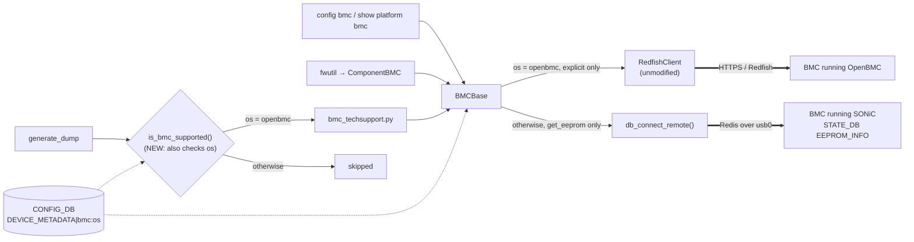
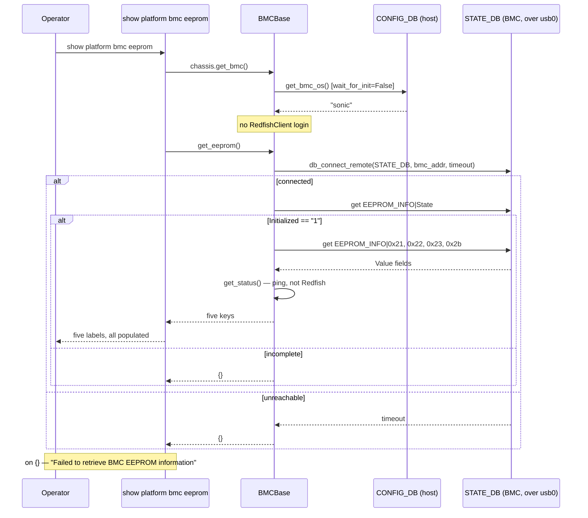

# Support BMC flows in SONiC

## Revision

| Rev | Date | Author | Change Description |
|---|---|---|---|
| 0.1 | 2026-05 | Yuazhe Wang | Initial version — BMC over Redfish |
| 0.2 | 2026-08-20 | Ben Levi | Add section 10, transport selection for a BMC running SONiC. Number the second "3" heading as 4 and cascade. Amend sections 6 and 7 where the new section changes their behaviour |
| 0.3 | 2026-08-23 | Ben Levi | Serve get_revision() from the BMC's EEPROM under sonic, per review |

## 1. BMC and Redfish 
Board Management Controller (BMC) is a specialized microcontroller embedded on a motherboard. It manages the interface between system management software and hardware. BMC provides out-of-band management capabilities, allowing administrators to monitor and manage hardware remotely.
OpenBMC is an open-source project that provides a Linux-based firmware stack for Board Management Controllers (BMCs). It implements the Redfish standard, allowing for standardized and secure remote management of server hardware. In essence, OpenBMC serves as the software that runs on BMC hardware, utilizing the Redfish API to facilitate efficient hardware management.
Redfish is a standard for managing and interacting with hardware in a datacenter, designed to be simple, secure, and scalable. It works with BMC to provide a RESTful API for remote management of servers. Together, Redfish and BMC enable efficient and standardized hardware management.
In summary, NOS will deal with BMC through the redfish RESTful API.


## 2. BMC flows in SONiC
The implementation is straightforward: SONiC will incorporate a Redfish client as the underlying infrastructure to support the BMC action. This Redfish client object is implemented and initialized at runtime by SONiC itself. 


## 3. BMC ip address initialization
This is the flow of the bmc ip address configuration: 
- device/platform/bmc.json contains bmc_if_name,bmc_if_addr,bmc_addr,bmc_net_mask
- src/sonic-py-common/sonic_py_common/device_info.py::get_bmc_data read the bmc.json  
- src/sonic-config-engine/sonic-cfggen::main call to device_info.get_bmc_data and write it to DEVICE_METADATA|bmc (This field will be added to DEVICE_METADATA )
- files/image_config/interfaces/interfaces.j2 read DEVICE_METADATA|bmc   write to /etc/network/interfaces:
```
auto usb0
iface usb0 inet static
    address <address>
    netmask <netmask>
```


## 4. BMC firmware upgrade flow

It requires a new ComponenetBMC object to be added to the component.py


## 5. Sonic-platform-common support for bmc

### 5.1 BMC redfish client
The redfish_client.py module provides the RedfishClient class, which facilitates BMC access via cURL requests to Redfish APIs. This class serves as a cURL wrapper for executing various Redfish commands. The class utilizes callback functions to obtain user credentials securely and supports asynchronous task monitoring to handle long-running operations like firmware updates and log dump.

Key functionalities:
1.	Session Management: Handles login and logout operations, ensuring secure sessions with the BMC. It manages tokens and session IDs, and automates re-login if tokens expire.
2.	Firmware Management: Supports listing, updating, and querying firmware versions using Redfish APIs.
3.	BMC Operations: Enables BMC reset requests, password changes, and triggering/debugging log dumps.
4.	Error Handling: Maps cURL error codes to RedfishClient error codes, and includes comprehensive error handling and logging.
5.	Security: Obfuscates sensitive information such as tokens and passwords in logs and command outputs.

### 5.2 BMC api scope
Because in SONiC, each command will be executed as a separate process, nothing will be shared between 2 commands. This requires 2 separate BMC RF sessions, so to avoid exhausting session numbers, we will have a logout call after each of the commands executed.
Thus, there will be a python decorator used for each API/fucntion, for both login and logout.
```
APIs inherited from Device Base
get_name()
get_presence()
get_model()
get_serial()
get_revision()
get_status()
is_replaceable()

BMC general APIs
Return dictionary (Manufacturer, Model, PartNumber, PowerState, SerialNumber) to show the eeprom info or exception with the failure reason 
Returns an empty dictionary {} if EEPROM information cannot be retrieved        
get_eeprom()

Return string to show the firmware version or exception with the failure reason         
Returns 'N/A' if the BMC firmware version cannot be retrieved       
get_version()

   
Returns: A tuple (ret, msg) where:
ret: An integer return code indicating success (0) or failure
msg: A string containing success message or error description      
reset_root_password()


Returns: A tuple (ret, (task_id, err_msg)) where:
ret: An integer return code indicating success (0) or failure
task_id: A string containing the Redfish task ID for monitoring
            the debug log dump operation. Returns '-1' on failure.
err_msg: A string containing error message if operation failed,
        None if successful 
trigger_bmc_debug_log_dump()

Returns: A tuple (ret, err_msg) where:
ret: An integer return code indicating success (0) or failure
err_msg: A string containing error message if operation failed            
get_bmc_debug_log_dump(task_id, filename, path)

param fw_image: string to indicate the path of the firmware image
Returns:A tuple (ret, msg) where:
ret: An integer return code indicating success (0) or failure
msg: A string containing status message about the firmware update
         
update_firmware(fw_image)

```

## 6. CLI commands
```
show platform bmc summary 
---------------------------
Manufacturer: XXXXX
Model: XXXXX
PartNumber: XXXXX
SerialNumber: XXXXX
PowerState: XXXXX
FirmwareVersion: XXXXX               

show platform firmware status
Component    Version                    Description
-----------  -------------------------  ----------------------------------------
ONIE         XXXXXXXXXXXXXXXXXXXXXXXXX  ONIE - Open Network Install Environment
SSD          XXXXXXXXXXXXXXXXXXXXXXXXX  SSD - Solid-State Drive
BIOS         XXXXXXXXXXXXXXXXXXXXXXXXX  BIOS - Basic Input/Output System
CPLD1        XXXXXXXXXXXXXXXXXXXXXXXXX  CPLD - Complex Programmable Logic Device
CPLD2        XXXXXXXXXXXXXXXXXXXXXXXXX  CPLD - Complex Programmable Logic Device
CPLD3        XXXXXXXXXXXXXXXXXXXXXXXXX  CPLD - Complex Programmable Logic Device
BMC          XXXXXXXXXXXXXXXXXXXXXXXXX  BMC – Board Management Controller

show platform bmc eeprom
---------------------------
Manufacturer: XXXXX
Model: XXXXX
PartNumber: XXXXX
PowerState: XXXXX
SerialNumber: XXXXX

config platform firmware install chassis component BMC fw -y ${BMC_IMAGE}

config bmc os <openbmc|sonic>

show platform bmc os
---------------------------
sonic

```

The last two commands are added by section 10. Every other command above is
available only when the BMC runs OpenBMC — see section 10.4.

## 7. show techsupport
When the BMC runs OpenBMC, its dump is included in the show techsupport:
trigger_bmc_debug_log_dump() and get_bmc_debug_log_dump() are called by the
generate-dump script. When the BMC runs SONiC neither is called and no BMC dump is
collected — see section 10.4.

### 7.1. Overview
The 'show techsupport' command is extended to collect BMC dump logs via Redfish API. 
This integration is non-blocking and asynchronous: 
It triggers a BMC dump task at the start of the script, then continues with regular 
system data collection. Before the script finishes, it collects the dump from BMC 
using the task ID previously received. 
The design ensures that BMC issues (timeouts, failures, unsupported platforms) 
do not block or interrupt the standard dump flow. 

### 7.2 High-Level Diagram


### 7.3 Errors Handling: 
- generate_dump check whether BMC is suppported — via the bmc.json file, and via the configured BMC OS (section 10.4). If not, BMC logic is skipped. 
- Errors in BMC initialization, trigger, or collect phases are caught and logged. 
- The timeout in techsupport script for collect_bmc_dump is set to 60 seconds. 
In practice, the dump is typically ready before collection begins. 
Since SONiC’s full techsupport script duration is already ≥ 1m20s, 
the BMC dump is often complete before reaching the collect stage. 
If not yet, we will wait for it with 60s timeout (a fallback and rarely used). 

## 8. Fast/Warm/Cold boot and SONiC upgrade flow
In general, this flow are cpu method so they are independent of bmc, no performace impact.

## 9. Further enhancement

After community review, there are two improvements that will be made in the 202605 branch:

1. The Redfish client will be added to the platform common API, providing support for these APIs, and it will be easier to extend for vendor-specific use.

## 10. Transport selection: Redis when the BMC runs SONiC

Everything above assumes the BMC runs OpenBMC and therefore serves Redfish. A BMC
may now run SONiC instead, which serves no Redfish, so every host-side operation in
`BMCBase` fails against it.

This section lets the operator declare which OS the BMC runs, routes the operations
that have a SONiC equivalent — `get_eeprom()` and `get_revision()`, both of which
read the BMC's EEPROM — to the BMC's Redis instead, and refuses the Redfish-only
operations with a clear message.
`redfish_client.py` is not modified and the Redfish path is unchanged.

### 10.1 Requirements

1. `DEVICE_METADATA|bmc` carries an optional `os` field accepting exactly `openbmc`
   and `sonic`.
2. `config bmc os <openbmc|sonic>` sets the field and rejects any other value.
   `show platform bmc os` displays the value in effect.
3. Only an explicit `openbmc` selects the Redfish path. An absent, unreadable or
   unrecognised value resolves to `sonic`. "Under `sonic`" below means the resolved
   value, so every statement holds for an absent field too.
4. Under `sonic`, `get_eeprom()` returns the same five keys the Redfish path
   returns, in the same flat dictionary: `Model`, `PartNumber`, `SerialNumber` and
   `Manufacturer` read from the BMC's `STATE_DB`, and `PowerState` derived from
   `get_status()`.
5. The BMC's EEPROM plugin parses the FRU board manufacturer, so `EEPROM_INFO`
   carries it.
6. Under `sonic`, `get_eeprom()` returns `{}` — never a partial dictionary and never
   an exception — when the BMC's Redis is unreachable or its EEPROM table is not yet
   complete, and returns within a bounded time.
7. Under `sonic`, `open_session`, `close_session`, `reset_root_password`,
   `update_firmware`, `request_bmc_reset`, `trigger_bmc_debug_log_dump` and
   `get_bmc_debug_log_dump` return their own failure shape carrying a message that
   names the reason, without attempting a Redfish login.
8. Under `sonic`, `get_version()` returns `'N/A'`.
9. Under `sonic`, `get_revision()` returns the label revision from the BMC's
   `EEPROM_INFO`, and `'N/A'` when it cannot be read. Under `openbmc` it returns
   `'N/A'` as it does today.
10. Every caller of a refused operation reports it without a traceback and with its
    present exit code.
11. `show platform bmc eeprom` and `show platform bmc summary` print their full
    label set under both settings.
12. Under `openbmc`, every existing BMC command behaves exactly as it does today,
    and no Redfish request changes.
13. Under `sonic`, `show techsupport` completes without invoking any BMC operation
    and without an error, and its archive carries no BMC dump — the same silent skip
    a platform with no BMC gets today. Under `openbmc` it collects the BMC dump as
    it does today.

Not in scope, and why:

- **Auto-detection of the BMC's OS.** Nothing in the tree can answer what the peer
  runs, and probing for Redfish would cost a connection timeout on every invocation
  against a SONiC BMC. The operator declares it.
- **`get_version` over Redis.** A SONiC BMC publishes no firmware inventory
  equivalent to the Redfish resource, so the value would have to be invented.
- **Firmware update, BMC reset, session management, root-password reset and
  debug-log dump over Redis.** Each is bound to a named Redfish resource —
  `UpdateService`, `Manager.Reset`, `SessionService`, `AccountService`,
  `LogServices/Dump`. A SONiC BMC can do these things but does not expose them this
  way, so each would be its own feature rather than a transport change.

### 10.2 Overview

`BMCBase` constructs a `RedfishClient` unconditionally today, and nothing records,
or lets the host discover, which OS the BMC runs. The approach is one configured
value and one branch.

Reading a remote Redis table is new; reaching the BMC's Redis is not.
`db_connect_remote()` in `sonic-py-common` already opens this connection for
`thermalctld`, which writes to it. This design reuses that helper to read.



The CLI and `fwutil` reach `BMCBase` under either setting and are refused inside
it. The techsupport path is the one caller stopped before `BMCBase` is constructed.

### 10.3 Configuration

A new `os` leaf on the existing `DEVICE_METADATA|bmc` container in
`sonic-device_metadata.yang`, an enumeration of `openbmc` and `sonic`, optional and
with no model default — the resolution rule lives in one place, in
`device_info.get_bmc_os()`, rather than being split between the model and the code.

| Field | Type | Values | Resolved when absent |
|---|---|---|---|
| `os` | string | `openbmc`, `sonic` | `sonic` |

`hostcfgd` returns early on every `DEVICE_METADATA` row that is not `localhost`, so
the field is inert for it.

**No `db_migrator` step is added.** A device whose BMC runs OpenBMC must carry `os`
set to `openbmc`, and that is a deployment-time requirement rather than something
the host infers or a migrator backfills.

`get_bmc_os()` must read CONFIG_DB with `connect(wait_for_init=False)`. The default
is `wait_for_init=True`, which blocks in an unbounded loop against a reachable but
uninitialised CONFIG_DB and cannot be caught, because it never raises. `BMCBase` is
constructed during platform-API initialisation, so a blocking read there would hang
callers with no diagnostic.

### 10.4 API behaviour under `sonic`

**`get_eeprom()`** reads the BMC's `STATE_DB` over the Host-BMC `usb0` link:

| Key | Field | Consumed as | |
|---|---|---|---|
| `EEPROM_INFO\|State` | `Initialized` | Completeness gate. Read first; anything other than `'1'` yields `{}` | existing |
| `EEPROM_INFO\|0x21` | `Value` | `Model` | existing |
| `EEPROM_INFO\|0x22` | `Value` | `PartNumber` | existing |
| `EEPROM_INFO\|0x23` | `Value` | `SerialNumber` | existing |
| `EEPROM_INFO\|0x27` | `Value` | `get_revision()` return | existing |
| `EEPROM_INFO\|0x2b` | `Value` | `Manufacturer` | **new** |

The gate is what makes requirement 6's "never a partial dictionary" deliverable.
The producer writes one hash per TLV as it walks them and sets `Initialized` last,
so the value keys can legitimately be observed half-written. The BMC's own EEPROM
reader gates on the same field.

`0x2b` is `_TLV_CODE_MANUF_NAME`. It is absent today for one reason: the BMC
plugin's `ipmi-fru` parsing table has no row for the manufacturer, so the value is
never parsed, encoded or posted. Adding the row is the whole fix — the TLV code
already exists and the decoder already handles it — and the value then reaches
Redis through the paths that already carry the other four.

**`get_revision()`** returns a hardcoded `'N/A'` today on both transports, and has
no caller anywhere in the tree — it exists to satisfy the `DeviceBase` contract.
Under `sonic` it returns `EEPROM_INFO|0x27`, the label revision. This costs
nothing: `0x27` is `_TLV_CODE_LABEL_REVISION` and is already one of the TLVs the
BMC plugin parses, from its `FRU Product Version` line, so no BMC-side change is
needed for it. It is also the value the BMC reports as its own chassis revision, so
the two sides agree. Under `openbmc` it keeps its present hardcoded `'N/A'`, for
the same reason as everything else on that path — this design does not touch it.
Since nothing calls it, this changes no command output, and deliberately stays
that way: a label on `show platform bmc summary` would read `N/A` under `openbmc`,
and requirement 12 forbids changing existing output. The value is reachable
through the platform API only.

**`PowerState`** is not EEPROM data, being a Redfish Chassis property, so there is
nothing in the table to read. It is derived from the existing `get_status()`, which
is usable here because it pings the address rather than issuing a Redfish request:
`'On'` when it returns true, `'Off'` otherwise. Its practical value is narrow — a
BMC that fails a ping will not have served its Redis either, so `get_eeprom()` will
already have returned `{}` and the key is never rendered.

**The refused operations** are gated by a decorator applied outside the existing
`with_session_management`, so it returns before the inner wrapper attempts a login.
It takes the refusal payload as a parameter, because these operations do not share
one return shape and a caller that destructures the second element would raise on a
flat one:

| Applied to | Refusal value |
|---|---|
| `close_session`, `reset_root_password`, `request_bmc_reset`, `get_bmc_debug_log_dump`, `_get_firmware_version` | `(ERR, msg)` |
| `open_session` | `(ERR, (msg, None))` |
| `update_firmware` | `(ERR, (msg, []))` |
| `trigger_bmc_debug_log_dump` | `(ERR, ('-1', msg))` |

Refusal reuses each operation's existing return contract, so **no caller needs a
code change**: the `config bmc` commands print the message and exit 0, `fwutil`
reports a failed update rather than a traceback, and `get_version()` maps its
worker's failure to `'N/A'`, which is what `fwutil` already renders when the BMC is
absent.

**`show techsupport`** is the one caller that changes outside `BMCBase`.
`is_bmc_supported()` in `generate_dump` has no notion of the BMC's OS, so without a
gate the dump path would run and reach a missing-tarball error. The gate skips both
BMC blocks. The skip is silent, matching what a platform with no BMC already does.

### 10.5 CLI

```
admin@sonic:~$ config bmc os sonic
admin@sonic:~$ config bmc os something-else
Usage: config bmc os [OPTIONS] [openbmc|sonic]
Try 'config bmc os --help' for help.

Error: Invalid value for '[openbmc|sonic]': 'something-else' is not one of 'openbmc', 'sonic'.

admin@sonic:~$ show platform bmc os
sonic
```

`click.Choice` rejects an invalid value at parse time, so it never reaches
CONFIG_DB. `show platform bmc eeprom` and `show platform bmc summary` keep their
present labels and ordering exactly, and under either transport every label carries
a value.

### 10.6 Sequence — `show platform bmc eeprom` under `sonic`



### 10.7 Performance

One CLI command per invocation, so there is no scale dimension. The Redis path is
the cheaper of the two: one TCP connection, then the completeness-gate read and
four value reads, against a Redfish login, an HTTPS GET and a logout.

The connect must be bounded, and today's helper cannot bound it —
`db_connect_remote` hardcodes a zero timeout, which resolves to a connect with no
explicit timeout. That is correct for `thermalctld`, which tees data best-effort
from a background thread, and wrong for a command a person is waiting on, where an
unreachable BMC would hold the terminal for the OS TCP default. The helper gains an
optional timeout parameter defaulting to the present value, leaving its one
existing caller unaffected.

### 10.8 Serviceability

Three new log lines from `bmc_base.py`, all needed because the operator-visible
output cannot distinguish these cases: an `INFO` at construction recording the
transport in effect; a `WARNING` naming a refused operation, which is the only
thing separating "not supported under this transport" from "attempted and failed";
and a `WARNING` when the BMC's Redis is unreachable or its EEPROM table is
incomplete, carrying the address and which of the two it was.

### 10.9 Restrictions and limitations

All of these apply under `sonic` only.

- **`Manufacturer` requires the BMC image to carry the new parsing rule.** A BMC
  running an older SONiC image publishes no manufacturer TLV, so the host renders
  `Manufacturer: N/A` against it. The host needs no version check: a missing key is
  already the `N/A` path.
- **The value can lag a BMC upgrade by one `syseepromd` cycle.** After the upgrade
  the EEPROM table may still hold the previous key set, and the completeness gate
  does not distinguish "complete" from "complete for an older plugin version". The
  daemon's integrity check notices the key set changed and reposts.
- **`Model` comes from the FRU Product Name TLV** and is not verified
  byte-identical to the string Redfish reports as `Model` on the same hardware.
  Both derive from the same physical field. The BMC's own `chassis.get_model()`
  returns the part number instead, so "model" is not used consistently across the
  two sides today.
- **`PowerState` reports reachability, not chassis power.** It is `On` whenever the
  EEPROM read succeeded, and cannot report `Off` in the same call that returns data.
- **`get_revision()` is served but not displayed, by decision.** No command reads
  it, and none is changed to, so the value is reachable only through the platform
  API. It also stays `N/A` under `openbmc`, since this design leaves the Redfish
  path alone.
- **Firmware version and firmware update are unavailable**, so
  `show platform firmware status` shows `N/A` for the BMC and `fwutil` reports a
  failed update.
- **`show techsupport` collects no BMC dump**, and the skip is silent.
- **An OpenBMC platform must set `os` explicitly**, because only an explicit
  `openbmc` selects Redfish and no migrator backfills the field.
- **The setting is not validated against the BMC.** Declaring `sonic` against a BMC
  running OpenBMC, or the reverse, produces failures rather than a diagnostic.
- **EEPROM data may be briefly unavailable after the BMC boots**, since the table
  appears when the BMC's `pmon` starts and its Redis binds the link address only
  after a wait loop. A retry resolves it.

### 10.10 Testing

| What is being tested | Test |
|---|---|
| Setting the value | `config bmc os sonic`, then `show platform bmc os` prints `sonic`; repeat with `openbmc`. Confirm the field in `show runningconfiguration all` |
| Rejecting a bad value | `config bmc os openbmk` fails at parse time with a usage error, and `show platform bmc os` still reports the previous value |
| Absent and invalid values | Remove the `os` field, then write it directly as a value that is neither name. In both cases `show platform bmc os` reports `sonic` and the Redis path is taken |
| EEPROM over Redis | Against a BMC running SONiC with `os` set to `sonic`, `show platform bmc eeprom` prints all five labels populated, the four EEPROM values matching that BMC's own `EEPROM_INFO` hashes, and `PowerState: On` |
| Manufacturer reaches Redis | On the BMC, `EEPROM_INFO\|0x2b` exists and its value equals the manufacturer in `ipmi-fru` output. Confirm `show platform syseeprom` on the BMC also lists it |
| Manufacturer against an older BMC image | With a BMC image lacking the parsing rule, `show platform bmc eeprom` prints `Manufacturer: N/A` and the other four populated, with no traceback |
| Summary under Redis | `show platform bmc summary` prints all six labels with `FirmwareVersion: N/A` |
| Revision over Redis | `get_revision()` on the BMC object returns the value of that BMC's `EEPROM_INFO\|0x27`. Under `openbmc` the same call returns `N/A` |
| Refusing the config commands | Each of `config bmc reset-root-password`, `config bmc open-session` and `config bmc close-session -s 1` prints a message naming the reason, produces no traceback, and exits 0 |
| Skipping the techsupport dump | `show techsupport` completes, its archive's `bmc/` directory is empty, and the output carries no `ERROR:` line |
| Refusing the firmware paths | `show platform firmware status` shows `N/A` for the BMC row, and a BMC firmware install reports a failure rather than a traceback |
| Unreachable BMC | With `usb0` down on the host, `show platform bmc eeprom` prints "Failed to retrieve BMC EEPROM information" and returns within a few seconds rather than hanging |
| Incomplete EEPROM table | On the BMC, set the EEPROM `Initialized` field to 0, then run `show platform bmc eeprom`. Same message as above, no partial values printed; restore it and the command succeeds |
| Regression on the Redfish path | With `os` set to `openbmc` against a BMC running OpenBMC, all existing BMC commands produce the same output as on the release without this change, and the BMC dump still appears in `show techsupport` |

### 10.11 Open items

- **Confirm the `ipmi-fru` line prefix for the board manufacturer.** The new
  parsing rule keys off the literal output prefix, as the existing rules do. The
  prefix implied by the IPMI Board Info Area and the existing `FRU Board …` rules
  has not been checked against real `ipmi-fru` output. If it differs, the rule is
  wrong and the manufacturer silently stays absent, because the parser matches by
  substring and does not report an unmatched rule.
