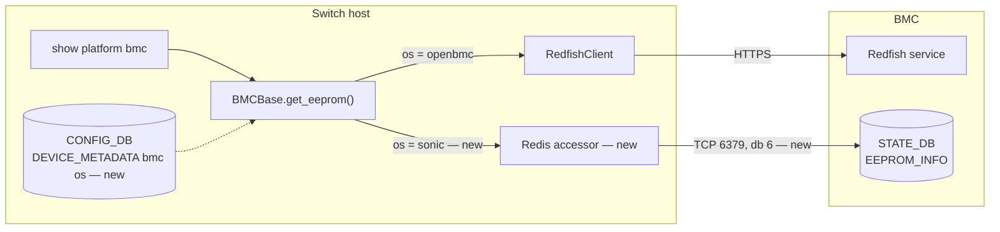
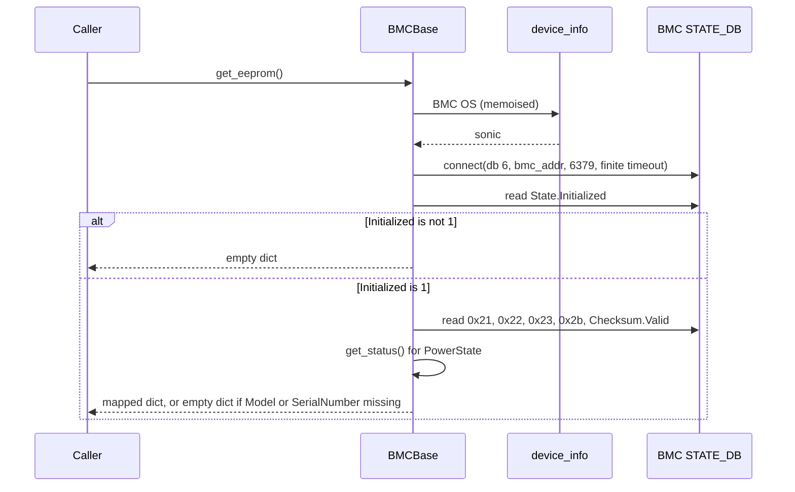

# Host to BMC communication over Redis

## Table of Content

- [1. Revision](#1-revision)
- [2. Scope](#2-scope)
- [3. Definitions/Abbreviations](#3-definitionsabbreviations)
- [4. Overview](#4-overview)
- [5. Requirements](#5-requirements)
- [6. Architecture Design](#6-architecture-design)
- [7. High-Level Design](#7-high-level-design)
- [8. SAI API](#8-sai-api)
- [9. Configuration and management](#9-configuration-and-management)
- [10. Warmboot and Fastboot Design Impact](#10-warmboot-and-fastboot-design-impact)
- [11. Memory Consumption](#11-memory-consumption)
- [12. Restrictions/Limitations](#12-restrictionslimitations)
- [13. Testing Requirements/Design](#13-testing-requirementsdesign)
- [14. Open/Action items](#14-openaction-items)

### 1. Revision

| Rev | Date | Author | Change Description |
|---|---|---|---|
| 0.1 | 2026-08-10 | NVIDIA | Initial version |

### 2. Scope

Adds Redis as a second host-to-BMC transport alongside Redfish, for platforms
whose BMC runs SONiC. Covers transport selection, serving `get_eeprom()` from the
BMC's `STATE_DB`, and the behaviour of the operations that have no Redis
equivalent.

On the BMC side, one addition: the ASPEED BMC's FRU parsing gains the manufacturer
TLV, so that the host can serve `Manufacturer` over Redis.

Out of scope:

- Any other BMC-side change. `EEPROM_INFO` population is otherwise existing
  behaviour.
- Redis equivalents for firmware update, BMC reset, root-password reset, session
  management and debug-log collection. These stay on Redfish.
- Removing or deprecating Redfish.

### 3. Definitions/Abbreviations

| Term | Definition |
|---|---|
| SONiC BMC | A BMC running SONiC rather than OpenBMC; publishes its inventory into its own Redis databases |
| FRU | Field Replaceable Unit — the IPMI inventory record format the BMC reads from its EEPROM |
| TLV | Type-Length-Value — the ONIE EEPROM encoding whose type codes key `EEPROM_INFO` |

### 4. Overview

On a BMC running SONiC, Redis is the source of truth and Redfish does not
implement every API the host needs. Requiring a full Redfish service on the BMC so
that the host can read a few EEPROM fields is avoidable work on both sides.

The transport therefore becomes a configured property of the platform, so one
image serves both kinds of BMC. Under Redis, `get_eeprom()` reads the BMC's
`STATE_DB` and returns every field its two CLI consumers display, which leaves
`get_model()`, `get_serial()` and both `show platform bmc` subcommands unchanged.
Operations with no Redis equivalent raise rather than degrade silently.

### 5. Requirements

1. The transport is selectable through CONFIG_DB, so one image serves both kinds
   of BMC.
2. Under Redis, `get_eeprom()` returns the BMC EEPROM read from the BMC's
   `STATE_DB`.
3. `get_eeprom()` returns the same dictionary key names under both transports,
   including `Manufacturer` and `PowerState` — every field the CLI displays.
4. `get_model()` and `get_serial()` return the BMC's model and serial under both
   transports.
5. Redfish-only operations raise `NotImplementedError` under Redis, and that
   exception reaches the caller rather than becoming an error return value.
6. `get_version()` returns `'N/A'` under Redis.
7. The Redis connection is constructed with a finite timeout.
8. Under Redis, a read that fails, or that cannot supply both `Model` and
   `SerialNumber`, returns an empty dictionary.
9. The `DeviceBase` APIs behave identically under both transports.
10. Both `show platform bmc` subcommands produce identical output under both
    transports, except for the firmware version, which is `N/A` under Redis.
11. The transport is CLI-configurable, modelled in YANG, and the configured value
    survives warm and fast reboot.
12. The ASPEED BMC publishes the manufacturer TLV into its `EEPROM_INFO`.

#### 5.1. Exemptions

- No DB migrator step. Anything other than an explicit `openbmc` resolves to
  `sonic`, including an absent or unreadable value (7.15).
- The Redis transport is unauthenticated.
- No Redfish operation gains a Redis equivalent.

### 6. Architecture Design

No architecture change. The selector and the second read path sit inside the
existing platform-API BMC layer; new elements are marked.



### 7. High-Level Design

#### 7.1. Feature type

Built-in SONiC feature.

#### 7.2. Modules and repositories changed

| Repository | Path | Change |
|---|---|---|
| `sonic-buildimage` | `src/sonic-yang-models` | New YANG leaf for the selector |
| | `src/sonic-py-common/sonic_py_common/device_info.py` | Accessor returning the configured BMC OS |
| | `platform/mellanox/mlnx-platform-api/sonic_platform/bmc.py` | Redfish credential requirement made conditional on transport |
| | `platform/aspeed/sonic-platform-modules-nvidia-bmc/ast2700/sonic_platform/eeprom.py` | Manufacturer TLV added to the BMC's FRU parsing rules |
| `sonic-platform-common` | `sonic_platform_base/bmc_base.py` | Transport branch, Redis read, TLV translation, Redfish-required gate |
| `sonic-utilities` | `config/bmc.py`, `doc/Command-Reference.md` | CLI and its documentation |

Everything under `src/sonic-py-common` and `platform/` is in-tree, so it rides the
`sonic-buildimage` pull request; the other two are submodules and get their own.
The ASPEED change ships in the BMC's own image rather than the host's.
**Ordering:** the `sonic-buildimage` accessor must be in the image before the
`sonic-platform-common` change is functional — 7.3 gives the fallback.

The Mellanox gate has three sites, all of which must become conditional, because
a SONiC-BMC platform may ship no `bmc_config.json` at all: the early return when
the build config is absent (`bmc.py:67-70`), the early return when it carries no
NOS account (`:71-74`), and the `get_instance()` gate itself (`:99`). Under
`sonic` the early returns must yield `bmc_addr` with the credential fields unset,
and the gate must test the address alone.

#### 7.3. Interfaces and dependencies

- A new `device_info` accessor returns the configured BMC OS. It memoises, giving
  one CONFIG_DB read per process.
- Two callers consult it: the Mellanox gate above and `BMCBase`. The gate
  necessarily runs first, so resolution cannot live in the `BMCBase` constructor.
- If the accessor is unavailable — an older installed `sonic_py_common` — resolve
  to `sonic` and log, per 7.15. It must not break BMC object construction.
- The Redis connector is constructed directly rather than through
  `daemon_base.db_connect_remote()`, which accepts no timeout and passes a
  constant of `0` (`daemon_base.py:15`).
- No long-lived holder exists: nothing under `src/sonic-platform-daemons` calls
  `get_bmc()`, so a transport change takes effect on the next command.

#### 7.4. SWSS and Syncd changes

N/A

#### 7.5. DB and schema changes

Defined — CONFIG_DB:

| Table | Key | Field | Type | Values |
|---|---|---|---|---|
| `DEVICE_METADATA` | `bmc` | `os` | string | `openbmc`, `sonic` |

The YANG container already exists (`sonic-device_metadata.yang:400-425`) but no
code populates the row, so `config bmc os` creates it.

Consumed — the BMC's `STATE_DB` `EEPROM_INFO`, written by `syseepromd`
(`eeprom_tlvinfo.py:746-776`) and keyed by `hex(TLV code)` (`:757`). Nothing is
written to the BMC.

| Source | Key returned |
|---|---|
| `EEPROM_INFO\|0x21`:`Value` (product name) | `Model` |
| `EEPROM_INFO\|0x22`:`Value` (part number) | `PartNumber` |
| `EEPROM_INFO\|0x23`:`Value` (serial number) | `SerialNumber` |
| `EEPROM_INFO\|0x2b`:`Value` (manufacturer) | `Manufacturer` |
| `EEPROM_INFO\|State`:`Initialized` | `State` = `Enabled` when `1` |
| `EEPROM_INFO\|Checksum`:`Valid` | `Health` = `OK` when `1` |
| `self.get_status()` | `PowerState` = `On` when true, else `Off` |

`PowerState` has no EEPROM source, so it comes from `get_status()`, which already
answers the same question by pinging the BMC (`bmc_base.py:320-334`). `0x24` and
`0x27` have no consumer and are not mapped. The Redfish inventory extras —
`ChassisType`, `Id`, `Name`, `HealthRollup` — are absent, and no consumer reads
them.

**BMC-side change for the manufacturer.** `0x2b` is not published today: the
ASPEED BMC's `PARSING_RULES` map five IPMI FRU lines to TLV codes and none is the
manufacturer (`ast2700/sonic_platform/eeprom.py:36-42`). Adding
`_TLV_CODE_MANUF_NAME` (`eeprom_tlvinfo.py:53`) to that map is sufficient, because
the rules drive both the synthesised TLV image and the Redis publication
(`eeprom.py:68-79`, `:109-135`). If the FRU image carries no board manufacturer
field, the EEPROM content itself must be updated to include one — see 14.

A BMC image without this change simply omits `0x2b`; the host reports `N/A` and
does not treat it as an incomplete read.

**Completeness.** `Initialized` is set even when the TLV walk aborts part-way
(`eeprom_tlvinfo.py:658-670`, `:775-776`), so a read missing `Model` or
`SerialNumber` returns `{}`. An invalid checksum instead reports through `Health`
and does not suppress the record.

**Upgrade.** No migrator, so a device with existing configuration has no row and
resolves to `sonic`. OpenBMC platforms must set `os` explicitly after upgrade;
release notes should carry it.

#### 7.6. Sequence diagram



Three constraints on the implementation:

- The transport check in `with_session_management` must run **before** the
  wrapper's `try` (`bmc_base.py:31-32`), or the `except` at `:44-48` converts the
  raise into an error tuple and requirement 5 silently fails.
- `open_session` (`:173`) and `wait_until_redfish_ready` (`:161`) are undecorated
  and carry their own guards.
- The completeness and checksum checks live in the Redis accessor, not in
  `get_eeprom()`, so the Redfish path is untouched.

#### 7.7. Linux dependencies and interfaces

TCP to the BMC's Redis over the internal link. The interface name and both
addresses come from `/etc/sonic/bmc.json` — `bmc_if_name`, `bmc_if_addr`,
`bmc_addr` — via `device_info.get_bmc_data()`. No new package or service.

#### 7.8. Warm reboot requirements and dependencies

N/A

#### 7.9. Fastboot requirements and dependencies

N/A

#### 7.10. Scalability and performance

One Redis connection and a few hash reads replace three `curl`-spawned HTTPS
requests. `PowerState` adds one `ping` with a one-second deadline, since it comes
from `get_status()` (7.5). No scale dimension: every caller is on demand and
nothing polls.

#### 7.11. Memory requirements

N/A

#### 7.12. Docker dependency

N/A

#### 7.13. Build dependency

N/A

#### 7.14. Management interfaces

CLI only; see 9.2.

#### 7.15. Serviceability and debug

Each new failure mode logs distinctly: no BMC address, connection failure or
timeout, table not initialised, `Model` or `SerialNumber` missing, invalid
checksum. Without that they all present as the same `Failed to retrieve BMC EEPROM
information` (`show/platform.py:150-152`).

Transport resolution is one rule: **only an explicit `openbmc` selects Redfish.**
An absent value, a failed CONFIG_DB read, an unavailable accessor and an
unrecognised value all resolve to `sonic`. Each of those four logs which one
applied, since the resolved transport is otherwise invisible and it determines
whether a subsequent failure is even meaningful.

`sonic` is therefore the default everywhere, not only where configuration is
absent. That is deliberate — it keeps one rule instead of two — and its cost is in
12: an OpenBMC platform that has not set `os` loses its Redfish operations.

#### 7.16. Platform applicability

Any platform whose BMC runs SONiC, gated on the `os` field and never on a SKU
comparison. To opt in, a platform needs its BMC populating `EEPROM_INFO`, the
existing link and `bmc.json`, and a vendor BMC class that constructs without
Redfish credentials (7.2). The shared YANG and platform-API additions should be
flagged to the community in advance.

### 8. SAI API

N/A

### 9. Configuration and management

#### 9.1. Manifest

N/A

#### 9.2. CLI/YANG model enhancements

```
config bmc os <openbmc|sonic>
```

Creates the `DEVICE_METADATA|bmc` row if absent and rejects any other value. Like
other `config` commands it writes the running CONFIG_DB, so `config save` is
needed to persist it (12). The YANG addition is an enum leaf on the existing `bmc`
container, and `Command-Reference.md` gains the command. No CLI deletions or
modifications; CLICK only.

Downward compatibility: configuration saved by a previous release restores
unchanged, since the leaf is optional — only the meaning of its absence differs
(7.5). Restoring *this* release's configuration onto an older image may be
rejected by a validating restore path, because the older YANG has no `os` leaf
(14).

#### 9.3. Config DB enhancements

One field added, per 7.5.

### 10. Warmboot and Fastboot Design Impact

N/A

#### 10.1. Warmboot and Fastboot Performance Impact

N/A

### 11. Memory Consumption

N/A

### 12. Restrictions/Limitations

- The BMC firmware version is unavailable under Redis; every other field the CLI
  displays is available under both transports.
- `Manufacturer` reads `N/A` against a BMC image that predates the ASPEED change
  (7.5).
- Firmware update, BMC reset, root-password reset, session management and
  debug-log collection are unavailable under Redis.
- The Redis transport is unauthenticated.
- Because `sonic` is the default for every unresolved case (7.15), an OpenBMC
  platform loses its Redfish operations until `os` is set explicitly — on upgrade,
  and for as long as `config bmc os` goes unsaved.
- One BMC at one address, as today.

### 13. Testing Requirements/Design

The existing `bmc_base_test.py` cases construct `BMCBase` with no CONFIG_DB
present, so they must pin `os` to `openbmc`. Unit tests are not run locally in
this flow, so an unpinned suite surfaces as a red pull request.

#### 13.1. Unit Test cases

- Routing per transport; the accessor is consulted once per process — the case must
  reset the vendor singleton or it passes vacuously (1, 3).
- Only an explicit `openbmc` selects Redfish: an absent value, a failed read, an
  unavailable accessor and an unrecognised value each resolve to `sonic` and log
  distinctly (1).
- A successful Redis read returns the mapped dictionary, `Manufacturer` included
  (2, 3).
- `PowerState` is `On` when `get_status()` is true and `Off` when it is false, with
  `get_status()` mocked both ways (3).
- `Manufacturer` is `N/A`, and the read is not treated as incomplete, when `0x2b`
  is absent (3, 8).
- `get_model()` and `get_serial()` from a Redis-sourced dictionary (4).
- Decorated Redfish-only operations raise, and the exception escapes the wrapper
  rather than becoming an error tuple (5).
- `open_session` and `wait_until_redfish_ready` raise — separate cases, since they
  are undecorated and a decorator-level test would not catch them (5).
- `get_version()` returns `'N/A'` and does not raise (6).
- The connector is constructed with database index, address, port and a finite
  timeout, asserted on the arguments rather than on wall-clock behaviour (7).
- `{}` for each of: no address, connection failure, `Initialized` unset, `Model`
  or `SerialNumber` missing (8).
- An invalid checksum returns the values with `Health` other than `OK` (2, 8).
- The `DeviceBase` APIs return identical results under both transports (9).
- Both CLI subcommands render under `sonic` with only `FirmwareVersion` as `N/A`,
  and neither aborts (10).
- The CLI accepts both values, rejects others and creates the row; YANG validates
  (11).
- On the BMC, the manufacturer line is parsed into `_TLV_CODE_MANUF_NAME` and
  reaches `EEPROM_INFO|0x2b`; the synthesised image and its checksum stay valid
  with the extra TLV (12).

#### 13.2. System Test cases

- Redis reads return the BMC's true model, part number, serial and manufacturer
  (2, 3).
- `PowerState` is `On` against a reachable BMC (3).
- Both CLI subcommands produce identical output under both transports, firmware
  version aside (10).
- Switching the transport takes effect without a reboot, run as separate
  invocations since the accessor memoises (1).
- An unreachable BMC and an uninitialised table both fail in bounded time rather
  than hanging the CLI (7, 8).
- The saved transport is still in effect after warm and after fast reboot,
  asserted on the selector itself (11).
- On an OpenBMC platform with `os` set explicitly, all existing BMC operations
  including firmware update still work.

### 14. Open/Action items

| Item | Owner |
|---|---|
| Author name in section 1 | Feature owner |
| Concrete timeout value for the Redis connection (7.6) | Feature owner |
| Whether a validating restore path rejects the new leaf on downgrade (9.2) | Feature owner |
| The exact `ipmi-fru` output label to match for the manufacturer, and whether the FRU image carries a board manufacturer at all or the EEPROM must be reprogrammed (7.5) | BMC platform owner |
| Whether a migrator step is preferred over explicit configuration on upgrade (7.5) | Feature owner and release owner |
| Whether the unauthenticated Redis path needs an authentication story (5.1) | Security reviewer |
