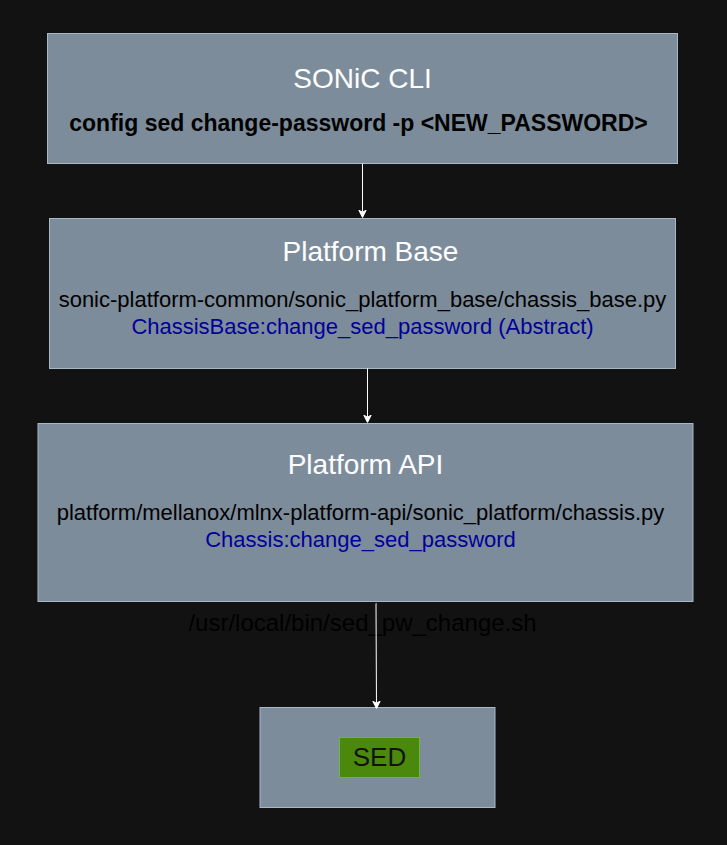

# SED Password Management HLD

## 1. Revision

| Rev | Date | Author | Change Description |
|:---:|:----:|:------:|:-------------------|
| 0.1 | 01/2026 | | Initial version |

## 2. Scope

This document describes the high-level design for "Change SED (Self-Encrypting Drive) password" in SONiC.
It covers the ability to change and reset SED passwords through SONiC CLI commands using the platform API.

## 3. Definitions/Abbreviations

| Definitions/Abbreviation | Description |
|--------------------------|-------------|
| SED | Self-Encrypting Drive |

## 4. Overview

Self-Encrypting Drives (SEDs) provide hardware-based encryption for storage devices.
There is a need to securely manage SED passwords with proper integration into SONiC systems while ensuring password persistence and recovery capabilities.
This feature provides comprehensive password lifecycle management, including change and reset operations.
SONiC's responsibility is to provide the ability to change and reset the SED password using a new SONiC CLI.

## 5. Requirements

| Requirement | Description |
|-------------|-------------|
| SSD | SSD with an activated SED support (LockingEnabled = Y LockingSupported = Y) |
| Platform Support | Platform must implement chassis APIs for SED management (`change_sed_password`, `reset_sed_password`) |

## 6. Architecture Design

The SED password management feature integrates with SONiC's existing platform API architecture. The CLI commands interact with the platform's chassis object to perform SED password operations.

## 7. High-Level Design



### Module Elements Breakdown

1. SONiC CLI creates a chassis object of the current platform (platform API).
2. If the chassis object of the current platform has implementation for `change_sed_password`, it will be called.
   Otherwise: "Error: SED management not supported on this platform"
3. The same applies for `reset_sed_password`.

**Change SED Password:**
```python
chassis = platform.Platform().get_chassis()
chassis.change_sed_password(password)
```

**Reset SED Password:**
```python
chassis = platform.Platform().get_chassis()
chassis.reset_sed_password()
```

### Change Password Flow

The change password CLI command allows the user to set a new SED password.

**CLI Command:**
```
config sed change-password -p <NEW_PASSWORD>
```

### Reset Password Flow

The reset password CLI command allows the user to reset the SED password to default.

**CLI Command:**
```
config sed reset-password
```

## 8. CLI Enhancements

### Change Password CLI

Change the SED password to a new value:

```
admin@sonic:~$ config sed change-password --help
Usage: config sed change-password [OPTIONS]

  Change SED password

Options:
  -p, --password TEXT  New password for SED [required]
  -?, -h, --help       Show this message and exit.
```

Example:
```
admin@sonic:~$ config sed change-password -p <NEW_PASSWORD>
```

### Reset Password CLI

Reset the SED password to a default value

```
admin@sonic:~$ config sed reset-password --help
Usage: config sed reset-password [OPTIONS]

  Reset SED password to default

Options:
  -?, -h, --help  Show this message and exit.
```

Example:
```
admin@sonic:~$ config sed reset-password
```

## 9. Testing Requirements/Design

New HLD document will be provided for the verification tests.
