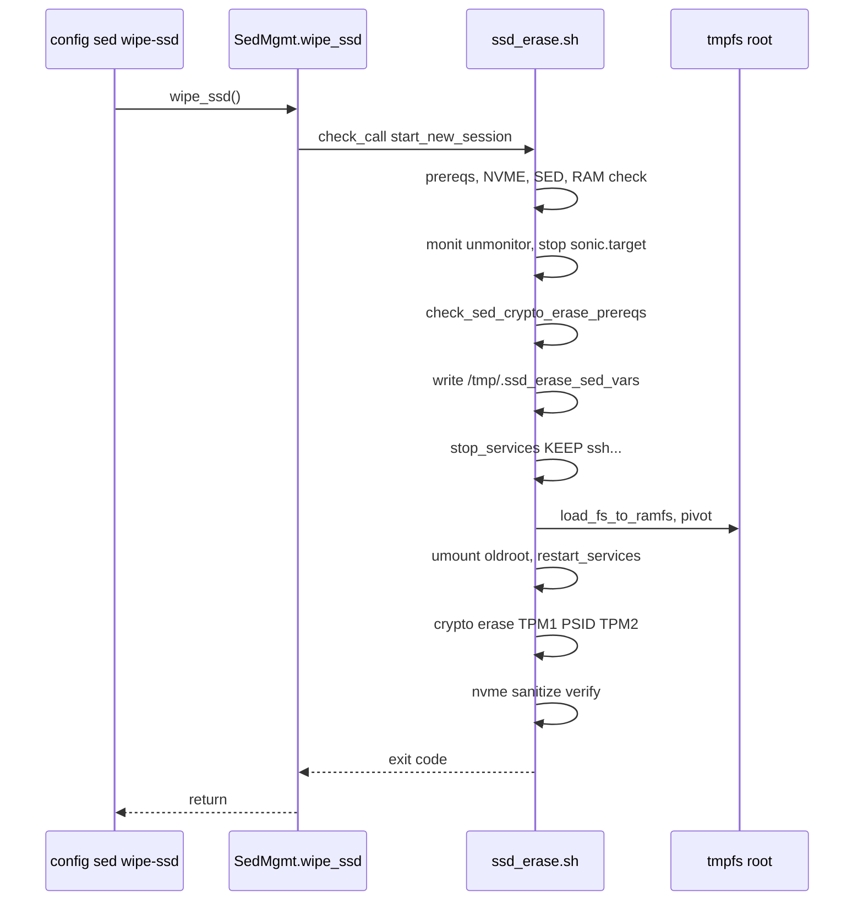

# SSD Wipe HLD

## 1. Revision

| Rev | Date | Author | Change Description |
|:---:|:----:|:------:|:-------------------|
| 0.1 | 03/2026 | | Initial version |

## 2. Scope

This document describes the high-level design for **SSD wipe** on SONiC switches with SED-enabled NVMe storage.

It covers:

- New CLI: `config sed wipe-ssd`
- Common platform API (`SedMgmtBase.wipe_ssd()`), common orchestration script (`ssd_erase.sh`), and extensions to `sed_pw_utils.sh`
- Platform-specific APIs and implementations

## 3. Definitions/Abbreviations

| Term | Description |
|------|-------------|
| SED | Self-Encrypting Drive |
| TPM | Trusted Platform Module; persistent handles store sealed SED passwords |
| PSID | Physical Security ID; factory credential used for PSID revert (crypto erase) |
| Crypto erase | PSID revert via `sedutil-cli`; removes SED locking keys so encrypted data is inaccessible |
| Block erase | NVMe sanitize (e.g. `--sanact=0x02`) to overwrite media |
| Ramdisk pivot | Copy minimal root to tmpfs, `pivot_root`, unmount OS disk, run erase from RAM |

## 4. Overview

### 4.1 Feature goal

Provide a controlled, destructive CLI to **securely wipe** the switch boot SSD when hardware-based encryption and sanitization are required.

**Primary use cases:**

| Use case | Description |
|----------|-------------|
| Decommission / disposal | Before removing or scrapping a switch, erase all user and system data so it cannot be recovered, including from physical access to the drive. |
| Physical access threat | Ensure data protected by SED is not recoverable if the SSD is extracted. |
| Runtime TPM bank loss | If SED TPM password banks are corrupted or out of sync at runtime (risk of lockout on next boot), a controlled wipe resets TPM banks to factory default and clears the drive so the platform can be reprovisioned. |

Wipe is **irreversible**. The device will not boot a usable SONiC image until reinstalled/reimaged after wipe and manual platform reset.

### 4.2 Relationship to change / reset password

| Command | Purpose | Mutates disk data |
|---------|---------|-------------------|
| `config sed change-password` | Set a new SED admin password; update TPM banks A/B | No (credentials only) |
| `config sed reset-password` | Restore platform default SED password in TPM and on drive | No (credentials only) |
| `config sed wipe-ssd` | Crypto + block erase; restore default password in TPM banks | **Yes (destructive)** |

Shared infrastructure:

- `chassis.get_sed_mgmt()` → `SedMgmt` instance
- `/etc/sonic/sed_config.conf` (`tpm_bank_a`, `tpm_bank_b`)
- `sed_pw_utils.sh` (TPM seal/unseal, disk discovery, SED checks)
- Image: `sedutil`, `tpm2-tools`, `nvme-cli`, `rsync`

## 5. Requirements

| ID | Requirement |
|----|-------------|
| R1 | Platform exposes `get_sed_mgmt()` with wipe support; `None` → CLI reports not supported. |
| R2 | SED enabled on OS NVMe (OPAL 2.0, `LockingEnabled = Y`). |
| R3 | PSID available (platform API `get_psid()`). |
| R4 | Default SED password readable (platform `get_default_sed_password()`). |
| R5 | TPM banks A/B configured in `/etc/sonic/sed_config.conf`. |
| R6 | Operator confirmation before wipe; CLI **blocks** until `ssd_erase.sh` exits (not fire-and-forget). Child runs in new session (`start_new_session=True`) so wipe continues if SSH drops. |

## 6. Architecture Design

The feature fits the existing SED platform model (see [change_sed_password_hld.md](change_sed_password_hld.md)):

```
┌─────────────────┐     ┌──────────────────┐     ┌─────────────────────────┐
│ config sed      │────▶│ SedMgmtBase      │────▶│ ssd_erase.sh            │
│ wipe-ssd        │     │ wipe_ssd()       │     │ (ramdisk pivot, erase)  │
└─────────────────┘     └────────┬─────────┘     └───────────┬─────────────┘
                                 │                           │
                                 ▼                           ▼
                        ┌───────────────────┐         ┌──────────────────┐
                        │ SedMgmt           │         │ sed_pw_utils.sh  │
                        │ platform specific │         │ sedutil, nvme,   │
                        │ getters           │         │ tpm2-tools       │
                        │                   │         └──────────────────┘
                        └───────────────────┘
```

## 7. High-Level Design

### 7.1 Repositories / paths changed

| Area | Path |
|------|------|
| CLI | `src/sonic-utilities/config/sed.py` |
| Common API | `src/sonic-platform-common/sonic_platform_base/sed_mgmt_base.py` |
| Platform | `platform/mellanox/mlnx-platform-api/sonic_platform/sed_mgmt.py` |
| Scripts | `files/image_config/sed_mgmt/ssd_erase.sh`, `sed_pw_utils.sh` (prereqs) |
| Image install | `files/build_templates/sonic_debian_extension.j2`, `build_debian.sh` (add `rsync` to host apt) |

### 7.2 Platform API (common + platform-specific)

**Common — new for wipe:**

| Method | Role |
|--------|------|
| `wipe_ssd()` | Validate parameters; run `ssd_erase.sh` via `subprocess.check_call(..., start_new_session=True)`; block until script exit; return success/failure |

**Platform-specific — new for wipe:**

| Method | Role |
|--------|------|
| `get_psid()` | Return PSID string for `sedutil-cli` PSID revert (Mellanox: parse `PSID` from `/var/run/hw-management/eeprom/vpd_data`) |

### 7.3 CLI design

**Command:** `config sed wipe-ssd`

| Step | Behavior |
|------|----------|
| 1 | `get_sed_mgmt()`; error if unsupported |
| 2 | `click.confirm` — destructive action, default `False` |
| 3 | Print start banner (see below) |
| 4 | `sed_mgmt.wipe_ssd()` — **blocks** until `ssd_erase.sh` exits |
| 5 | Print success or failure |

**Start banner:**

```text
Performing Action SSD Erase - Please wait 5 minutes until SSD is wiped.
Please verify the success logs once execution is done.
You need to reboot the system once done (e.g. sudo /sbin/reboot).
```

If the SSH session drops during pivot/umount, the wipe may still complete in the background; check syslog (`logger` from `ssd_erase.sh` / SED scripts).

**Post-wipe reboot:** Use **`sudo /sbin/reboot`** (or BMC/power cycle). Full SONiC `/usr/local/bin/reboot` is **not** supported after wipe (requires `/host`, Redis, stopped NOS stack).

### 7.4 `ssd_erase.sh` — single orchestration script

One file at `/usr/local/bin/ssd_erase.sh` (functions inside the script). Sources `/usr/local/bin/sed_pw_utils.sh`.

**Arguments:**

```text
ssd_erase.sh -a <tpm_bank_a> -b <tpm_bank_b> -p <default_password> -s <psid>
```

**Phase overview:**



#### 7.4.1 Pre-pivot preparation

| Step | Action |
|------|--------|
| Tools | Require `rsync`, `sedutil-cli`, `nvme`, `tpm2_*`; fail with clear error if `rsync` missing |
| Memory | `free -g`, require **available ≥ 6** (GiB, `Mem:` line column 7); matches default `SSD_ERASE_TMPFS_SIZE=6G`. On failure: message to reboot and retry |
| SED prereqs | `check_sed_crypto_erase_prereqs` in `sed_pw_utils.sh` (PSID, single NVMe, OPAL 2.0, `LockingEnabled = Y`, default password). Args `-s`/`-p` from Python cross-check VPD/TPM |
| Block prereqs | NVMe only: sanitize support via `nvme id-ctrl` |
| Stop SONiC | `wall`; `monit unmonitor container_checker`; `systemctl stop sonic.target --job-mode replace-irreversibly` (same as `reset-factory`) |
| Stop other daemons | **`stop_services()`** — stop every running unit **not** in `KEEP_SERVICES`. Required because `database.service` and `docker.service` still run after `sonic.target` stop alone |
| Persist vars | Write `/tmp/.ssd_erase_sed_vars` (mode 600): `nvme_disk_name`, `psid_val`, `default_pw`, `tpm_reg`, `tpm_reg_2` |

#### 7.4.2 Ramdisk pivot (SONiC mounts)

**Goal:** Run erase while OS disk is unmounted; keep SSH and minimal userspace on tmpfs. Addresses Debian 12+ pivot issues via **selective `/var` + service model**, not by disabling pivot.

**Order:** `dmesg -D` → `stop_services` → `load_fs_to_ramfs` → `pivot_to_ramfs` → restore `.ssd_erase_sed_vars` → `umount_disk` → `restart_services` → erase phases.

**`KEEP_SERVICES`** (do not stop during `stop_services`):

- `ssh.service` (primary on SONiC image; not only `sshd.service`)
- `dbus.service`, `systemd-udevd.service`, `systemd-journald.service`, `systemd-logind.service`
- `getty@tty1.service`
- `pam-auth.service`, `acpid.service` — include **if unit exists** on image

**`load_fs_to_ramfs`:**

| Copy | Notes |
|------|--------|
| `swapoff -a` | |
| tmpfs `6G` on `/newroot` | `SSD_ERASE_TMPFS_SIZE` (default `6G`; prereq GB should match) |
| `/bin`, `/etc`, `/mnt`, `/sbin`, `/lib`, `/lib64` | Full copy |
| `/usr/bin`, `/usr/sbin`, `/usr/lib`, `/usr/lib64`, `/usr/libexec`, `/usr/share` | Tools only; **no Python packages on ramdisk** |
| `/usr/local/bin` | SED scripts, `ssd_erase.sh` (unchanged SONiC `reboot` script may be copied but not used post-wipe) |
| `/newroot/root` | mkdir |
| `/var/log/syslog` | Only syslog, not full `/var/log` (on SPC6, `/var/log` may be a separate loop mount) |
| `/home/admin` | `rsync -a --max-size=100M` → `/newroot/home/admin` (SONiC uses `/home/admin`) |
| `/var` selective | **`rsync` required** — `/var/lib` with excludes: `docker/`, `containerd/`, `dpkg/`, `apt/`, `redis/`, and other bulky subtrees; rsync `local`, `opt`, `spool`, `lock`, `run` if present. Fallback full `cp -ax /var` only if `rsync` absent (avoid on SONiC — image must ship `rsync`) |

**`pivot_to_ramfs`:** `mount --make-private`; `pivot_root /newroot /newroot/oldroot`; `mount --move` `dev`, `proc`, `sys`, `run` from `/oldroot`; `mkdir -p /home` on newroot.

**`umount_disk`:**

On overlay-based SONiC, under `/oldroot` typical mounts include:

- `/` → `root-overlay` (upper/work on `/host/.../rw`)
- `/host` → `/dev/nvme0n1p3`
- `/var/lib/docker` → same partition
- `/var/log` → loop file on `/host`
- `/boot` → subpath on host FS

**Best-effort lazy umount order** (log each step; **abort wipe** if critical mounts remain busy):

1. Docker merged overlays under `/oldroot/var/lib/docker/overlay2/.../merged` (if mounted)
2. `/oldroot/var/lib/docker`
3. `/oldroot/var/log`
4. `/oldroot/boot`
5. `/oldroot/host`
6. `/oldroot` (remaining old root / overlay)

Use `umount -l` where needed. First hardware wipe may tune order via `findmnt /oldroot`.

**`restart_services`:** Restart running units except **`NO_RESTART`**: `serial-getty@ttyS0.service`, `rsyslog.service`, `docker.service`, `containerd.service`, `monit.service`.

Restore SED variables from `/oldroot/tmp/.ssd_erase_sed_vars` or `/tmp/.ssd_erase_sed_vars` after pivot.

#### 7.4.3 Erase on ramdisk (NVMe only)

| Step | Action |
|------|--------|
| 1 | `store_sed_pwd_in_tpm` **bank A** ← `default_pw` |
| 2 | `sedutil-cli --yesIreallywanttoERASEALLmydatausingthePSID <psid> <nvme_ctrl>` |
| 3 | `store_sed_pwd_in_tpm` **bank B** ← `default_pw` (on failure log and **continue** to block erase) |
| 4 | `nvme sanitize <disk> --sanact=0x02` |
| 5 | Poll `nvme sanitize-log` (parse status with `sed` on text output; timeout up to **20 min**, interval **5 s**; no `jq` requirement) |
| 6 | Log success/failure; **exit** (no reboot) |

`nvme_disk_name` is the controller name (e.g. `nvme0`), derived from partition device (e.g. `/dev/nvme0n1`).

**No** `sedutil --setadmin1pwd` after PSID revert.

### 7.5 `sed_pw_utils.sh` extensions

Add **`check_sed_crypto_erase_prereqs`**:

- PSID, `sedutil-cli`, disk discovery, OPAL 2.0, `LockingEnabled`, default password from TPM bank 3 / platform
- Returns 0 and sets `psid_val`, `nvme_disk_name`, `default_pw` on success

Existing helpers reused: `find_disk_name`, `check_sed_support`, `store_sed_pwd_in_tpm`, `get_tpm_sed_auth`, logging.

### 7.6 Mellanox platform

| Item | Implementation |
|------|----------------|
| `get_psid()` | Read PSID from `/var/run/hw-management/eeprom/vpd_data` |
| `get_default_sed_password()` | Existing: `/usr/local/bin/read_default_sed_pw_from_tpm.sh` (TPM `0x81010003`) |
| `sed_config.conf` | `build_debian.sh` sets `tpm_bank_a` / `tpm_bank_b` for `CONFIGURED_PLATFORM=mellanox` |
| Chassis | `get_sed_mgmt()` returns `SedMgmt.get_instance()` |
